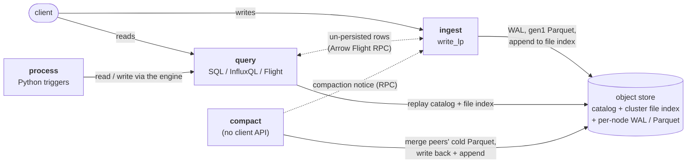

<p align="center">
  
</p>

# VarveDB

VarveDB is a fork of [InfluxDB 3 Core](https://github.com/influxdata/influxdb)
that adds multi-node clustering.

A varve is a pair of sediment layers deposited over a single year — a
naturally occurring time series, readable by counting strata. The name
fits how the database stores data: immutable columnar layers accumulating
in object storage, compacted over time, with a shared log recording which
layers are live.

## What's added

- **Cluster file index** — a single CAS-appended log giving every node a
  globally ordered view of the cluster's Parquet files, replacing per-node
  manifest polling.
- **Cluster-aware Processing Engine** — trigger placement across nodes, so
  scheduled and request plugins run where you pin them instead of everywhere.
- **Node modes** — ingest, query, compact, and process as separate tiers, or
  `core` / `all` combined on a single node.

Nodes share nothing but object storage and a catalog. There is no
coordinator, no gossip, and no node-to-node dependency for durability.

## Architecture

Every node runs the same binary and takes on a set of roles chosen with
`--mode`. Nodes share exactly two things through object storage — one
**catalog** (the schema) and one **cluster file index** (the log of every
Parquet file) — and nothing else. There is no coordinator, no gossip, and no
node-to-node dependency for durability: a node that loses every peer still
answers from object storage.



| role | `--mode` | does | never |
|------|----------|------|-------|
| **ingest** | `ingest` | accepts line-protocol writes; buffers in the WAL, persists gen1 Parquet under its own prefix, and appends every new file to the shared index; serves its un-persisted rows to query nodes over Arrow Flight | — |
| **query** | `query` | serves SQL / InfluxQL / Flight, reading cluster-wide: the shared catalog, every peer's Parquet via the replayed file index, and ingesters' buffered rows over RPC | accepts writes (returns `421`); persists anything; publishes a peer address |
| **compact** | `compact` | merges small, cold gen1 Parquet belonging to ingest peers into fewer large files and writes them back into the owner's prefix, then hands the owner a notice so the *owner* records the merge (it alone allocates in its sequence space); deletes merged-away inputs after `--compact-input-grace`. Exactly one per cluster | accepts writes; serves queries; combines with another role |
| **process** | `process` (implied by `--plugin-dir`) | runs the embedded Python Processing Engine; `node_spec=nodes:<id>` on a trigger pins its scheduled / WAL / request plugins to named nodes instead of every node | — |

`core` (the default) is `ingest` + `query` on one node — the original
single-node behaviour. `all` is every role in one process and compacts its own
Parquet in-process. `ingest`, `query`, and `process` may be combined
(`--mode ingest,query,process`); `core`, `all`, and `compact` may not.

**Shared substrate**

- **Catalog** — one schema for the cluster, stored under the `--cluster-id`
  prefix, polled on `--catalog-sync-interval`.
- **Cluster file index** — a single compare-and-swap–appended log. One
  cluster-wide monotonic sequence orders every Parquet addition and removal, so
  a node can tell when its view is behind instead of silently serving short
  results; periodic rollup snapshots collapse the log. Replayed on
  `--file-index-sync-interval`.
- **Per-node data** — WAL, Parquet, snapshots and table indices live under
  `{node_id}/` and are written only by that node — the sole exception being a
  compactor writing a merged file into an ingester's prefix, which the ingester
  then acknowledges.
- **Peer RPC** — Arrow Flight on `--cluster-rpc-bind`: query → ingester for
  un-persisted rows, compactor → owner for the compaction notice. `query` and
  `compact` nodes publish no address and are never dialled.

Role assignment is static: membership is read on every query and compaction
pass, but existing placements are not rebalanced when a node joins or leaves.
Deeper walkthroughs and diagrams: [docs/cluster/](docs/cluster/).

## Try it

Build the binary, then stand up a local cluster:

```sh
cargo build --bin varvedb
```

**A cluster you drive yourself** — 2 ingest + 2 query + 1 compact node, one
shared local object store, no auth:

```sh
docs/cluster/scripts/cluster-playground.sh          # Ctrl-C to stop all five
```

| role    | endpoints                                          |
|---------|---------------------------------------------------|
| ingest  | `http://127.0.0.1:8181`, `http://127.0.0.1:8182`  |
| query   | `http://127.0.0.1:8183`, `http://127.0.0.1:8184`  |
| compact | background only — merges the ingesters' cold Parquet |

Write line protocol to an **ingest** node:

```sh
curl -sS "http://127.0.0.1:8181/api/v3/write_lp?db=sensors&precision=second" \
  --data-binary "cpu,host=a,region=west usage=0.62,temp=48 $(date +%s)"
# -> HTTP 204
```

Query from a **query** node — it sees data from every ingester, cluster-wide:

```sh
curl -sS --get "http://127.0.0.1:8183/api/v3/query_sql" \
  --data-urlencode "db=sensors" \
  --data-urlencode "q=SELECT host, count(*) n, avg(usage) avg_usage FROM cpu GROUP BY host" \
  --data-urlencode "format=jsonl"
# {"host":"a","n":1,"avg_usage":0.62}
# {"host":"b","n":2,"avg_usage":0.63}
```

A write sent to a query node is refused:

```sh
curl -sS -i "http://127.0.0.1:8183/api/v3/write_lp?db=sensors" --data-binary "cpu x=1"
# HTTP/1.1 421 Misdirected Request
# {"error":"this node runs in query-only mode and does not accept writes; ..."}
```

Stop it from another shell with
[`docs/cluster/scripts/cluster-shutdown.sh`](docs/cluster/scripts/cluster-shutdown.sh).

More, including InfluxQL and how to watch the compactor:
[docs/cluster/cluster-playground.md](docs/cluster/cluster-playground.md).

**A scripted, self-checking walkthrough** of the same roles — write routing,
cluster-wide reads, and cross-node compaction with assertions —
[docs/cluster/live-test-node-modes.md](docs/cluster/live-test-node-modes.md):

```sh
docs/cluster/scripts/node-modes-live-test.sh
```

## Status

Experimental. Not affiliated with or endorsed by InfluxData.

## License

MIT or Apache-2.0, at your option — the same terms as upstream InfluxDB 3 Core.
See [LICENSE-MIT](LICENSE-MIT) and [LICENSE-APACHE](LICENSE-APACHE).
"InfluxDB" is a trademark of InfluxData, Inc. VarveDB is an independent fork.
