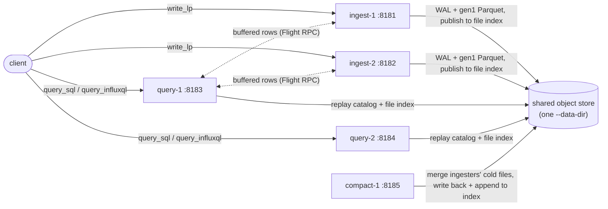

# Cluster playground — 2 ingest + 2 query + 1 compact

Start a five-node `feat/cluster-mode` cluster on localhost and leave it running
so you can drive it yourself over the HTTP API.

| script | what it does |
|--------|--------------|
| [`scripts/cluster-playground.sh`](scripts/cluster-playground.sh) | starts the five nodes, waits for health, prints a cheat-sheet, stays in the foreground |
| [`scripts/cluster-shutdown.sh`](scripts/cluster-shutdown.sh) | stops a running playground from another shell |

For a scripted, self-checking walkthrough of the same roles, see
[live-test-node-modes.md](live-test-node-modes.md).

## Layout

| node | `--mode` | HTTP | RPC | role |
|------|----------|------|-----|------|
| ingest-1  | `ingest`  | `127.0.0.1:8181` | `:8281` | accepts writes; serves its buffered rows to query peers |
| ingest-2  | `ingest`  | `127.0.0.1:8182` | `:8282` | second ingester — split write load across the two |
| query-1   | `query`   | `127.0.0.1:8183` | `:8283` | serves queries only; refuses writes (`421`) |
| query-2   | `query`   | `127.0.0.1:8184` | `:8284` | second querier — both see the whole cluster |
| compact-1 | `compact` | `127.0.0.1:8185` | `:8285` | merges both ingesters' small cold gen1 Parquet; no client API |

All five share one `--data-dir` (one local-file object store) and
`--cluster-id playground`. The shared catalog and cluster file-index log live
under `playground/`; each node's WAL and Parquet live under its own `{node_id}/`.



## Run it

```sh
cargo build --bin varvedb

# foreground; Ctrl-C stops all five
docs/cluster/scripts/cluster-playground.sh

# options
docs/cluster/scripts/cluster-playground.sh /path/to/data     # choose the data dir
RESET=1 docs/cluster/scripts/cluster-playground.sh           # wipe the data dir first
BIN=/path/to/varvedb docs/cluster/scripts/cluster-playground.sh
```

Data and logs persist under the data dir (`./.cluster-playground` by default)
between runs unless `RESET=1`. A `sensors` database is created on start; a write
to any database also auto-creates it.

Stop it from another shell:

```sh
docs/cluster/scripts/cluster-shutdown.sh                     # default ./.cluster-playground
docs/cluster/scripts/cluster-shutdown.sh /path/to/data
```

## API examples

All verified against the running playground. `format` accepts
`json` | `jsonl` | `csv` | `pretty` | `parquet`.

### See the cluster

```sh
curl -sS --get "http://127.0.0.1:8183/api/v3/query_sql" \
  --data-urlencode "db=_internal" \
  --data-urlencode "q=SELECT node_id, mode, state FROM system.nodes ORDER BY node_id" \
  --data-urlencode "format=jsonl"
```

```json
{"node_id":"compact-1","mode":["compact"],"state":"running"}
{"node_id":"ingest-1","mode":["ingest"],"state":"running"}
{"node_id":"ingest-2","mode":["ingest"],"state":"running"}
{"node_id":"query-1","mode":["query"],"state":"running"}
{"node_id":"query-2","mode":["query"],"state":"running"}
```

### Write line protocol — to an ingest node

```sh
TS=$(date +%s)

curl -sS "http://127.0.0.1:8181/api/v3/write_lp?db=sensors&precision=second" \
  --data-binary "cpu,host=a,region=west usage=0.62,temp=48 $TS"          # -> HTTP 204

# split load across the second ingester; the body may hold many lines
curl -sS "http://127.0.0.1:8182/api/v3/write_lp?db=sensors&precision=second" \
  --data-binary "cpu,host=b,region=east usage=0.55,temp=51 $TS
cpu,host=b,region=east usage=0.71,temp=53 $((TS+1))"                     # -> HTTP 204
```

### Query — from a query node (SQL)

Data written to **both** ingesters is visible from **either** query node:

```sh
curl -sS --get "http://127.0.0.1:8183/api/v3/query_sql" \
  --data-urlencode "db=sensors" \
  --data-urlencode "q=SELECT host, count(*) n, avg(usage) avg_usage FROM cpu GROUP BY host ORDER BY host" \
  --data-urlencode "format=jsonl"
```

```json
{"host":"a","n":1,"avg_usage":0.62}
{"host":"b","n":2,"avg_usage":0.63}
```

```sh
curl -sS --get "http://127.0.0.1:8184/api/v3/query_sql" \
  --data-urlencode "db=sensors" \
  --data-urlencode "q=SELECT host,region,usage,temp,time FROM cpu ORDER BY time DESC LIMIT 5" \
  --data-urlencode "format=jsonl"
```

```json
{"host":"b","region":"east","usage":0.71,"temp":53.0,"time":"2026-09-09T02:48:59"}
{"host":"b","region":"east","usage":0.55,"temp":51.0,"time":"2026-09-09T02:48:58"}
{"host":"a","region":"west","usage":0.62,"temp":48.0,"time":"2026-09-09T02:48:58"}
```

### Query — InfluxQL

```sh
curl -sS --get "http://127.0.0.1:8183/api/v3/query_influxql" \
  --data-urlencode "db=sensors" \
  --data-urlencode "q=SELECT mean(usage) FROM cpu WHERE time > now() - 5m GROUP BY time(1m)" \
  --data-urlencode "format=jsonl"
```

### A write to a query node is refused

```sh
curl -sS -i "http://127.0.0.1:8183/api/v3/write_lp?db=sensors" --data-binary "cpu x=1"
```

```
HTTP/1.1 421 Misdirected Request
{"error":"this node runs in query-only mode and does not accept writes; send writes to a node started with --mode ingest"}
```

### Watch the compactor

`compact-1` merges the ingesters' small, cold gen1 Parquet in the background.
With the playground's tunables (`--gen1-duration 1m`, `--compact-interval 30s`,
`--compact-min-age 2m`) a file becomes eligible ~2 minutes after its minute
bucket closes.

```sh
tail -f ./.cluster-playground/logs/compact-1.log      # look for "compacted files"
find ./.cluster-playground -name '*.parquet'          # count drops as merges land
```

```
INFO influxdb3_cluster::compactor: starting compactor node_id=compact-1 interval_secs=30 min_age_secs=120 ...
INFO influxdb3_cluster::compactor: compacted files target=ingest-1 db_id=DbId(1) table_id=TableId(0) inputs=7 input_rows=175 output_rows=175
```

## Notes

* **No auth** (`--without-auth`) — do not expose these ports.
* **Localhost only.** `--cluster-rpc-bind` is `127.0.0.1:*` here; on multiple
  hosts each node must publish an address its peers can actually reach.
* **Persistence.** WAL replays on restart, so data survives a stop/start of the
  playground unless you pass `RESET=1`.
* **Tuned for observability, not throughput** — tiny gen1 windows and a
  snapshot on every WAL flush. Raise `--gen1-duration` /
  `--wal-files-per-snapshot` for anything load-bearing.
* **Placement is not re-evaluated on join/leave** — the set of nodes is read
  each compaction pass and each query, but existing assignments are not
  rebalanced when a node comes or goes.
