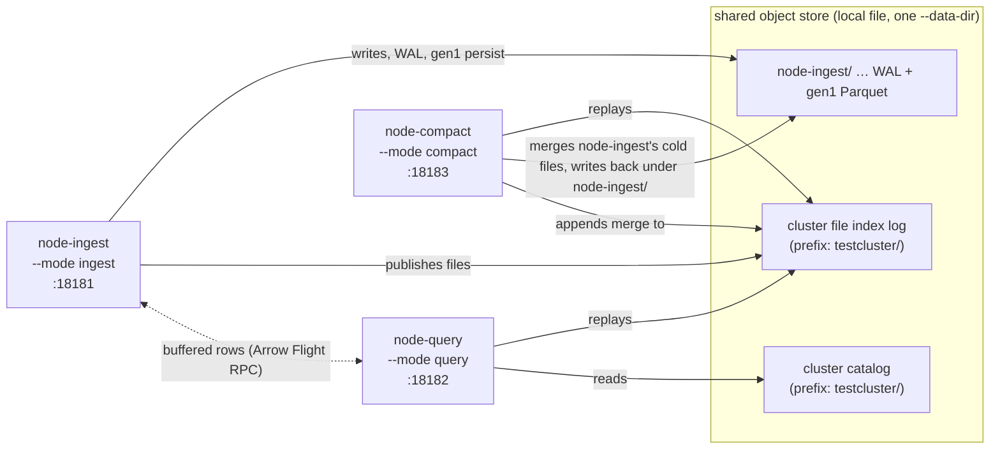

# Live test — split `ingest` / `query` / `compact` node modes

A hands-on walkthrough that stands up a real three-process `feat/cluster-mode`
cluster on localhost, one shared local object store, with each cluster role in
its own process, and checks the behaviour end to end.

Runnable form: [`scripts/node-modes-live-test.sh`](scripts/node-modes-live-test.sh).
For the automated, assertion-driven counterpart that also drives the Processing
Engine across nodes, see
[`influxdb3_cluster/tests/downsampler_e2e`](../../influxdb3_cluster/tests/downsampler_e2e/README.md).

## What it exercises

| # | Behaviour | How it is shown |
|---|-----------|-----------------|
| 1 | **Role registration** — a node advertises only the modes it was started with | `SELECT node_id, mode, state FROM system.nodes` |
| 2 | **Write routing** — `--mode query` and `--mode compact` refuse writes; only an ingester takes them | `POST /api/v3/write_lp` returns `421` vs `204` |
| 3 | **Cluster-wide reads** — rows written only to the ingester are visible from the query node, which persists nothing itself | `SELECT count(*)` on the query node; its data dir stays empty |
| 4 | **Cross-node compaction** — the compact node merges the ingester's small, cold gen1 Parquet into one file, and no rows are lost | file count under the ingester's prefix drops; `count(*)` is unchanged |

## Topology



Every node shares the catalog and the file-index log (both under the
`--cluster-id` prefix). Data — WAL, gen1 Parquet, snapshots, table indices —
stays under each node's own `{node_id}/` prefix. `node-query` and `node-compact`
do not ingest, so neither starts the peer-chunk RPC server and neither publishes
a `conn_info` address; `node-compact` registers with `conn_info="<none>"`.

## Prerequisites

* A built binary: `cargo build --bin influxdb3` (the script uses
  `target/debug/influxdb3`; pass another path as `$1`).
* `curl`. No Python, no network, no auth (`--without-auth`).
* Everything runs under a fresh `mktemp -d`; the three servers are killed on
  exit and the logs are left in `"$workdir"/logs`.

## Running it

```sh
cargo build --bin influxdb3
docs/cluster/scripts/node-modes-live-test.sh
# or: docs/cluster/scripts/node-modes-live-test.sh /path/to/influxdb3
```

## The tunables that make it quick

The cluster is started with small windows so a handful of writes produce several
tiny Parquet files, and the compactor is told to act almost immediately:

| flag | value here | default | why |
|------|-----------|---------|-----|
| `--gen1-duration` | `1m` | `10m` | smallest gen1 window, so each backdated minute is its own file |
| `--wal-flush-interval` | `1s` | `1s` | — |
| `--wal-files-per-snapshot` | `1` | `600` | snapshot (persist gen1) on every WAL flush |
| `--catalog-sync-interval` | `1s` | `1s` | — |
| `--file-index-sync-interval` | `1s` | `5s` | query/compact nodes replay the shared index every second |
| `--compact-interval` | `5s` | `5m` | compaction pass cadence |
| `--compact-min-age` | `1s` | `20m` | how old a file's `chunk_time` must be to be merge-eligible |
| `--compact-input-grace` | `8s` | `1h` | how long a merged-away input survives on disk before reclamation |

In a real deployment only the first group is a normal choice; the
`--compact-*` values are deliberately reckless to keep the test short.

## Annotated transcript

Ports, timestamps and the merged-file hash vary per run; the shape does not.

### 1 — role registration

Started `node-ingest` and `node-query` first (the compactor joins in step 7).
Read from the query node:

```
{"node_id":"node-ingest","mode":["ingest"],"state":"running"}
{"node_id":"node-query","mode":["query"],"state":"running"}
```

Each node carries exactly the mode it was launched with. (`--plugin-dir` would
add `process`; nothing else is implicit.)

### 2–3 — write routing

```
Database "sensors" created successfully

write -> node-query  : HTTP 421   (Misdirected Request)
write -> node-ingest : HTTP 204   (No Content)
```

The `421` body is explicit:

```json
{"error":"this node runs in query-only mode and does not accept writes; send writes to a node started with --mode ingest"}
```

`421` is the correct code — the request reached a server that cannot answer it
and the client should retry elsewhere, not a `500`. A write to `node-compact`
(step 7) returns the same `421`.

### 4–5 — write to one node, read from another

Eight batches of 25 rows (`room` measurement, 25 `rack` tags), each stamped one
minute apart and about an hour in the past, are POSTed **only to `node-ingest`**.
Then, from **`node-query`**:

```
{"rows":200,"racks":25,"tmin":20.0,"tmax":34.0}
```

All 200 rows are visible from a node that has an empty data directory:

```
node-query stores no Parquet of its own:
  count: 0
```

`node-query` sees persisted rows by replaying the shared **cluster file index**,
and sees rows still buffered on `node-ingest` (the most recent minute, not yet
persisted) over an Arrow Flight **buffered-row RPC** to the ingester. The count
is 200 the entire time — before, during and after compaction.

### 6 — the ingester's gen1 Parquet, before the compactor joins

```
node-ingest/dbs/1/0/2026-09-09/02-05/0000000003.parquet (1577 bytes)   <- "probe" measurement (1 row, from the step-3 write check)
node-ingest/dbs/1/1/2026-09-09/01-05/0000000003.parquet (2724 bytes)   <- "room", one file per minute bucket
node-ingest/dbs/1/1/2026-09-09/01-06/0000000003.parquet (2724 bytes)
node-ingest/dbs/1/1/2026-09-09/01-07/0000000004.parquet (2724 bytes)
node-ingest/dbs/1/1/2026-09-09/01-08/0000000005.parquet (2723 bytes)
node-ingest/dbs/1/1/2026-09-09/01-09/0000000006.parquet (2724 bytes)
node-ingest/dbs/1/1/2026-09-09/01-10/0000000007.parquet (2723 bytes)
node-ingest/dbs/1/1/2026-09-09/01-11/0000000008.parquet (2721 bytes)
  count: 8
```

Seven `room` files (`dbs/1/1/...`) — one per closed minute bucket — plus the
one-row `probe` file under `dbs/1/0/`. The eighth batch's bucket is still open in
`node-ingest`'s buffer, which is why the persisted `room` row count (7 × 25 =
175) is short of the 200 the query node reports.

### 7–8 — the compactor joins and merges

```
register node node_id="node-compact" core_count=11 mode=[Compact] conn_info="<none>"
node does not ingest; not starting the peer chunk RPC server
starting compactor node_id=node-compact interval_secs=5 min_age_secs=1 target_size_bytes=536870912 max_inputs=100
compacted files target=node-ingest db_id=DbId(1) table_id=TableId(1) inputs=7 input_bytes=19063 input_rows=175 output_bytes=2959 output_rows=175
```

One pass, one merge group: the seven cold `room` files → a single file written
back under **`node-ingest/`**'s prefix (the compactor persists it as that node
and notifies the owner over RPC). `input_rows == output_rows == 175`.

### 9–10 — after compaction

```
node-ingest/dbs/1/0/2026-09-09/02-05/0000000003.parquet (1577 bytes)
node-ingest/dbs/1/1/2026-09-09/01-05/0000000000-3493786486.parquet (2959 bytes)
  count: 2

{"rows":200}

parquet files under node-ingest/ : 8  ->  2
cluster-wide row count (node-query): before=200  after=200
PASS: compaction reduced the file count with no row loss
```

The seven inputs are gone from disk (reclaimed once `--compact-input-grace`
elapsed — logged at `debug`), replaced by one merged file. The `probe` file is
untouched (a group of one is never rewritten). `node-query` still reports 200:
175 from the merged file via the file index, 25 still buffered on `node-ingest`
via RPC.

## Notes and gotchas

* **The `probe` file.** The step-3 "does the ingester accept writes" check writes
  one real row (measurement `probe`) into `sensors`, so a second table shows up
  on disk under `dbs/1/0/`. It is left out of compaction because a single file is
  never a merge candidate.
* **Seven persisted, not eight.** The newest minute bucket stays in the
  ingester's write buffer until the buffer advances past it. Those rows are real
  and queryable — they travel to `node-query` over the buffered-row RPC, not the
  file index. Wait longer (or write an extra later batch) and the eighth file
  persists too.
* **`is_compactable`.** A remote compactor only rewrites files of peers whose
  mode set contains `Ingest` and not `Compact`. `--mode ingest` and
  `--mode ingest,query` both qualify; `--mode core` does **not** (it registers
  as `Core`, a distinct variant, not `Ingest`), so this test uses a dedicated
  `--mode ingest` node. A `--mode all` node is also skipped by this predicate —
  it compacts its own files in-process instead, through the same code path.
* **Merge eligibility** is `chunk_time < now - compact-min-age` **and**
  `size_bytes < compact-max-input-size` (100 MiB), needing at least two such
  files per table. Backdating the data makes every bucket cold immediately.
* **`--compact-input-grace`** must, in production, exceed the longest query the
  cluster runs — a query that resolved the old file paths before the swap keeps
  reading them until the grace period deletes them.
* **macOS.** The script avoids GNU-only `find -printf`; it works with BSD `find`.
* **Placement is not re-evaluated on join/leave.** Starting the compactor after
  data already exists is fine (it scans peer prefixes on each pass), but note the
  cluster does not rebalance existing assignments when a node joins or leaves.

## Cleanup

The script kills all three servers on exit (`trap ... EXIT`). The work
directory under `$TMPDIR` is left in place so the logs can be inspected; delete
it by hand when done.
