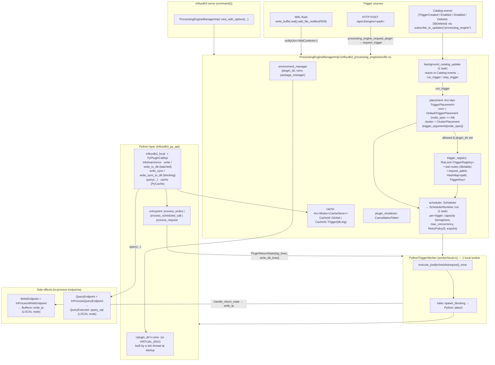

# Processing Engine — architecture

Component map of the Processing Engine (`influxdb3_processing_engine` + `influxdb3_py_api`),
including the cluster `TriggerPlacement` seam (`influxdb3_catalog::enterprise::trigger_placement`,
`influxdb3_cluster::pe_placement`). For how a trigger gets from an event to a Python call and
back, see the companion sequence diagrams:

- [Startup, registration & the placement gate](sequence-startup-and-placement.md)
- [WAL-flush trigger](sequence-wal-trigger.md)
- [Scheduled trigger (`every:` / `cron:`)](sequence-schedule-trigger.md)
- [HTTP request trigger (`request:<path>`)](sequence-request-trigger.md)

## Component diagram

## Key facts

- Built **unconditionally** in `serve.rs`; **inert without `--plugin-dir`** (`run_trigger`
  short-circuits, plugin reads fail). `--plugin-dir` also builds/uses the venv and, in a
  cluster, adds `NodeMode::Process` to the node's registered modes.
- One process-wide `Scheduler` + one local `PythonTriggerWorker`. Python runs on
  `spawn_blocking` threads via `Python::attach`.
- The plugin file is read **lazily per invocation** (`worker/local.rs` `read_plugin_code`),
  not at startup — a missing file is a per-tick error (per `--error-behavior`), never a boot
  failure.
- `influxdb3_local.write()` / `.query()` hit the **local** node only. Cross-node write-back
  is left to the plugin (see `README_processing_engine.md`, "Running in a cluster").
- 3.11 reliability: per-trigger admission `Semaphore` (`queue_size`) + dispatch bound
  (`max_concurrency` from `--async-trigger-concurrency-limit`; sync triggers = 1);
  `RetryPolicy` = 5 attempts, exponential backoff capped at 5s; empty WAL flushes are
  skipped at three layers (WAL buffer check, `wal_invocations`, worker re-check).
- Trigger placement (`run_trigger`'s gate) is behind a trait
  (`influxdb3_catalog::enterprise::trigger_placement::TriggerPlacement`) so the single-node
  build's behaviour (`DefaultTriggerPlacement`: only triggers with no node targeting) is
  unchanged, and a cluster build supplies `influxdb3_cluster::pe_placement::ClusterPlacement`
  instead. See [Startup, registration & the placement gate](sequence-startup-and-placement.md).
