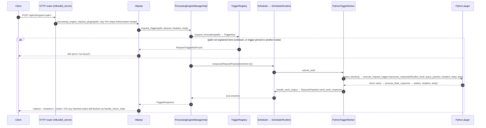

# Sequence: HTTP request trigger (`request:<path>`)

See [architecture.md](architecture.md) for the component map.

## Notes

- There is **no cross-node routing**: `/api/v3/engine/<path>` only resolves on nodes where the
  trigger's placement (`TriggerPlacement::allows`) let it register — an unpinned trigger
  registers (and answers) on every processing-engine node; a pinned one only answers on its
  target node(s). A request that lands on a node without the route gets a plain 404, not a
  redirect or proxy — point a load balancer at the node(s) the trigger is actually placed on.
  See [Startup, registration & the placement gate](sequence-startup-and-placement.md).
- The `Authorization` header is stripped before the plugin sees the request; the plugin gets
  the remaining headers, query params, and raw body.
- The Python entrypoint's return value goes through `process_flask_response`, so a plugin can
  return a bare body, or a `(body, status)` / `(body, status, headers)` tuple Flask-style.
- Any writes the plugin batched via `influxdb3_local.write(...)` during the call are flushed
  through the same `handle_return_state` path used by the WAL and schedule triggers — see
  [WAL-flush trigger](sequence-wal-trigger.md) — before the HTTP response is sent back.
