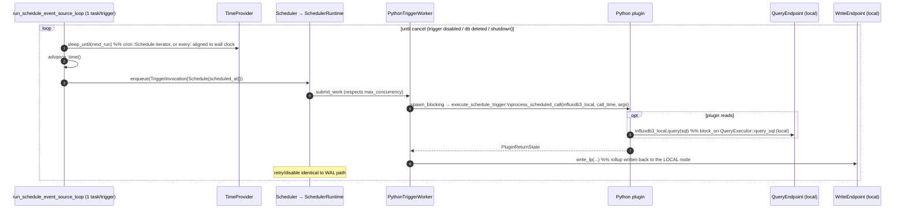

# Sequence: scheduled trigger (`every:` / `cron:`)

See [architecture.md](architecture.md) for the component map.

## Notes

- One dedicated tokio task per scheduled trigger (`run_schedule_event_source_loop`), not a
  shared timer wheel; `every:` ticks are aligned to the wall clock (not "N seconds after the
  last run"), `cron:` uses the standard 6-field `cron::Schedule` iterator.
- `influxdb3_local.query(...)` and `.write(...)` inside the plugin both resolve to the
  **local** node's endpoints (`InProcessQueryEndpoint` / `InProcessWriteEndpoint`) regardless
  of cluster topology — a rollup that needs cluster-wide data has to fan out itself (e.g. query
  a query-serving node's HTTP API) rather than relying on the engine to do it.
- In a cluster, a schedule trigger left unpinned (`node_spec` absent/`all`) runs on **every**
  processing-engine node — the classic duplicate-execution footgun for anything with a side
  effect (e.g. writing a rollup twice). Pin it to one node with
  `--trigger-arguments node_spec=nodes:<node-id>` unless duplication is actually intended (e.g.
  a purely informational log). See
  [Startup, registration & the placement gate](sequence-startup-and-placement.md).
- Retry/backoff/disable behavior is shared code with the WAL and request paths — see
  [WAL-flush trigger](sequence-wal-trigger.md#notes).
