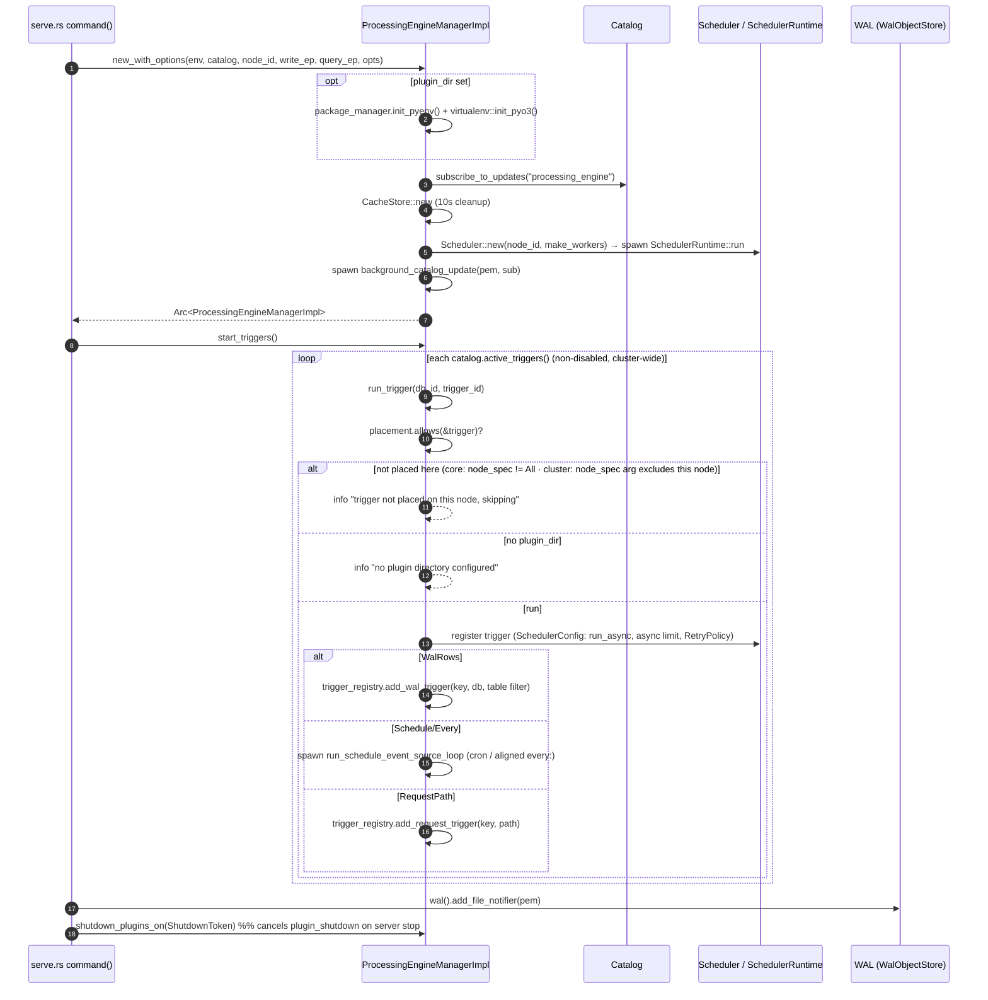
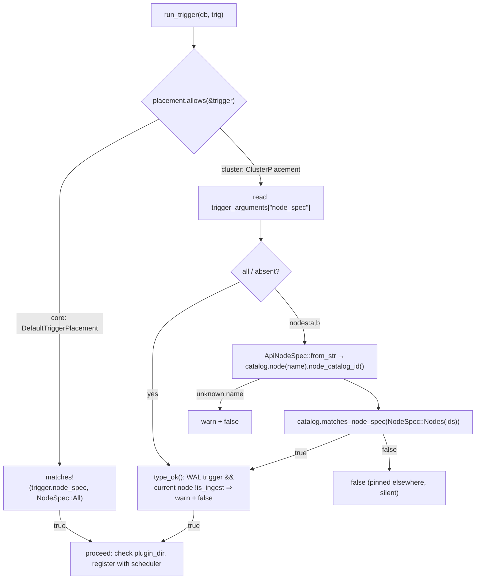

# Sequence: startup, trigger registration & the placement gate

See [architecture.md](architecture.md) for the component map.

`create trigger` at runtime follows the same gate: HTTP
`POST /api/v3/configure/processing_engine_trigger` → `Catalog::create_processing_engine_trigger`
→ CAS-append to the shared catalog log → `CatalogEvent::TriggerCreated` → every node's
`background_update` poller replays it → `background_catalog_update` → `run_trigger` (same
placement check as above).

## The placement gate

- **Core** (`influxdb3_catalog::enterprise::trigger_placement::DefaultTriggerPlacement`):
  behaviour-preserving — a trigger runs here only if its catalog `node_spec` is `All`.
- **Cluster** (`influxdb3_cluster::pe_placement::ClusterPlacement`): placement is read from
  the trigger's `trigger_arguments["node_spec"]` (e.g.
  `--trigger-arguments node_spec=nodes:host01,host02`), not the catalog `node_spec` field
  (which the create path always leaves as `All`). A WAL trigger that resolves to a node
  which does not ingest is refused with a loud warning — it would never fire there.
- `run_trigger` is the **only** per-node "should I run this trigger" decision point; it is
  reached from `start_triggers()` (boot) and from `background_catalog_update`'s
  `TriggerCreated` / `TriggerEnabled` handling.
- Placement is **not** re-evaluated on `NodeRegistered` / `NodeUnregistered` — this is a
  deliberate choice, not a gap. To move a running trigger onto a newly-added node, edit the
  trigger (disable + enable re-runs placement everywhere) or restart that node. Rationale is
  in the `influxdb3_cluster::pe_placement` module docs and `README_processing_engine.md`.
