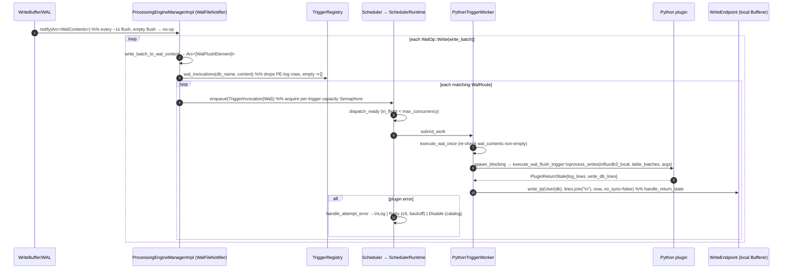

# Sequence: WAL-flush trigger

See [architecture.md](architecture.md) for the component map.

## Notes

- A WAL trigger only sees writes flushed on the node it runs on — the WAL is per-node. In a
  cluster, pin it to the ingest node whose data it should react to
  (`--trigger-arguments node_spec=nodes:<ingest-node-id>`); see
  [Startup, registration & the placement gate](sequence-startup-and-placement.md). Placement
  refuses (with a `warn!`, not a crash) to run a WAL trigger on a node that does not ingest —
  it would simply never fire there.
- Empty flushes are filtered at three separate points so an idle table costs nothing: the WAL
  buffer's own empty check, `TriggerRegistry::wal_invocations` returning `[]` for a flush with
  no matching rows, and the worker's own re-check in `execute_wal_once` before it pays for a
  Python call.
- Retry/backoff and the eventual `Disable` (persisted back to the catalog so every node stops
  retrying, not just this one) are identical across all three trigger kinds — see
  `SchedulerRuntime::handle_attempt_error`, `RetryPolicy` = 5 attempts, exponential backoff
  capped at 5s.
